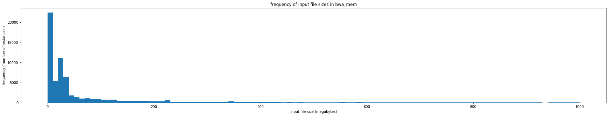
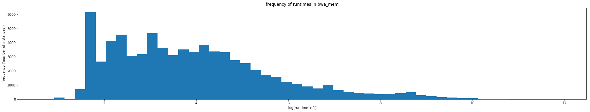
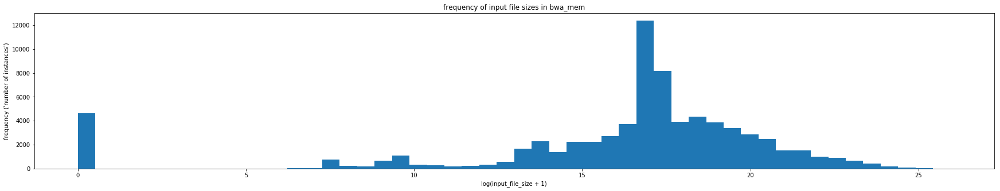
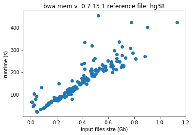
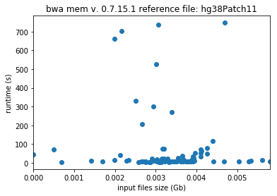
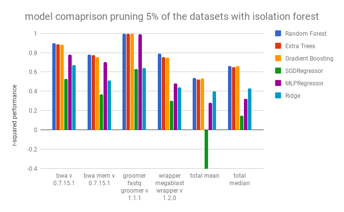
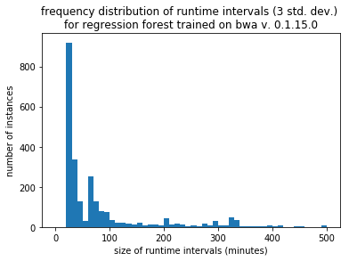
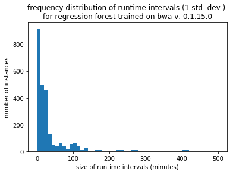
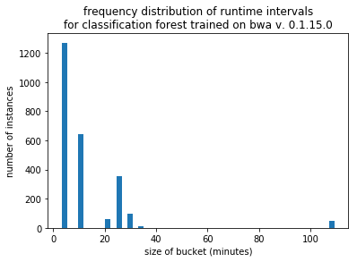
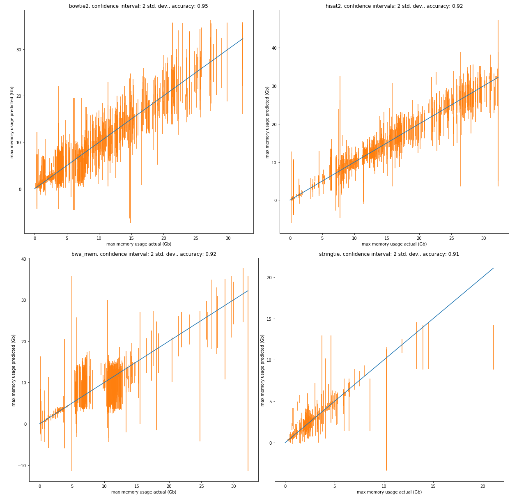

# The Analysis of Data Collected by the Galaxy Project

## Abstract
The Main public server of the Galaxy Project (https://usegalaxy.org) has been collecting extensive job run data on all analyses since 2013. This large collection of job runs with attributes can be leveraged to determine more efficient ways for allocation of server resources. In addition, these data represent the largest, most comprehensive dataset available to date on the runtime dynamics for some of the most popular biological data analysis software. In this work we were aiming at creating a model to predict the runtime and max memory usage of complex algorithms trained on real data. In this paper we will:

1. Present statistical summaries of the dataset, describe its structure, identify the presence of
undetected errors, and discuss any other insights into the Galaxy server that we believe will be
useful to the community.
2. Confirm that the random forest regressor gives the best performance for predicting the runtime
of complex algorithms as was seen by Hutter et al.
3. Discuss the benefits and drawbacks of using a quantile random forest for creating runtime
prediction confidence intervals.
4. Present an alternative approach for choosing a walltime for complex algorithms with the use of
5. Consider the applicability of runtime and memory use prediction for tools run on Galaxy servers with different hardware.
a random forest classifier.

Studying the Galaxy Project dataset reveals that there may be room to fine tune the resource allocation.
The ability to determine appropriate walltimes and RAM allowance will save server resources from jobs that result in errors
undetected by the server — such as jobs that fall into infinite loops. Once freed, these resources can then be used to run jobs in the queue without the need to allocate additional hardware.

## Table of Contents

- [Background](#what-is-the-galaxy-project)
  + [What is the Galaxy Project](#what-is-the-galaxy-project)
  + [The Galactic Radio Telescope and Tracking Data](#the-galactic-radio-telescope-and-tracking-data)
  + [scikit-learn and machine learning](#scikit-learn-and-machine-learning)
  + [Previous work on the prediction of resource usage of programs](#previous-work-on-the-prediction-of-resource-usage-of-programs)
- [Overview of Data](#overview-of-data)
  + [Distribution of the Data](#distribution-of-the-data)
  + [Undetected Errors](#undetected-errors)
  + [user selected parameters](#user-selected-parameters)
  + [attribute preprocessing](#attribute-preprocessing)
- [Model Comparison](#model-comparison)
- [Estimating a Range of Runtimes](#estimating-a-range-of-runtimes)
- [Using a random forest classifier](#using-a-random-forest-classifier)
- [Maximum Memory use Prediction](#maximum-memory-use-prediction)
- [Walltime and Memory Requirement Estimations as an API](#walltime-and-memory-requirement-estimations-as-an-api)
- [Future Work](#future-work)
- [References](#references)

### What is the Galaxy Project

The Galaxy Project is a platform that allows researchers to run popular bioinformatics analyses on designated servers. In the past, trying to run a popular analysis would require downloading, configuring, and troubleshooting the analysis software on one's own machines. This can be a difficult and time consuming task.

With the Galaxy Project, researchers can run analyses using the graphical user interface through the web. To do so, the user needs only to connect to a Galaxy server (e.g. https://www.usegalaxy.org), upload their data, choose the analysis and the analysis parameters, and hit run.

The Galaxy Project has been storing the information about the execution of these analyses since 2013, and, to date, has the largest dataset of the performance of popular bioinformatics tools. We begin to study this dataset in this paper.

For more information visit https://www.galaxyproject.org.

### The Galactic Radio Telescope and Tracking Data

All Galaxy instances have an option to keep records of runtime data. This is a service that adminstrators can select when configuring a Galaxy. The most widely used Galaxy instance, Galaxy main, does so, and the data collected on Galaxy main is the data used in these tests.

If adminstrators of other Galaxy instances would like to share their runtime data with the community, they can do so with the [Galactic Radio Telescope (GRT)](https://telescope.galaxyproject.org/). The GRT is an API service that allows Galaxy admins to export their data and have it released to the public in a standard package. For more information visit the [documentation](https://docs.galaxyproject.org/en/master/admin/special_topics/grt.html).

### scikit-learn and machine learning

scikit-learn is a library of machine learning tools for Python. It has classes for anything machine learning related - from data preprocessing to regression and classification to model evaluation. The sci-kit learn library is the main library we used in our tests, specifically the regression and classification classes.

In this paper our main tool for regression and classification was the random forest, so we will briefly go over random forests now.

A random forest is a collection of decision trees which themselves are series of questions asked about an object. At the end of the questions, a previously unknown attribute of the object is guessed. An example of a decision tree is shown below. In this case, the decision tree tries predicting how long a job is going to take.

The decision tree learns what questions to ask by training on a set of previous jobs. At each node, it looks at a subset of attributes and chooses to split the data in the way that minimizes variability in the subsequent two nodes. In this way, it sorts objects by similarity of the dependent and independent variables. In the figure below, a decision tree is training on a set of 100 jobs. All 100 jobs start at the root node, and they are split up as they travel down the tree. Once the tree is trained, it can then be used to predict the runtime of previously unseen jobs.

A random forest is a collection of decision trees, each of which are trained with a unique random seed. The random seed determines which sub-sample of the data each decision tree is trained and which sub-sample of attributes each tree uses and which splits each tree attempts. By implementing these constraints, the random forest protects itself from overfitting - a problem to which decision trees are susceptible.

Incidentally, the decision tree also offers a way to see which independent attributes have the greatest effect on the dependent attribute. The more often a decision tree uses an attribute to split a node, the larger its implied effect on the dependent attribute. The scikit-learn Random Forest classes have a way of getting this information with the feature_importances_ class attribute.

### Previous work on the prediction of resource usage of programs

The prediction of runtimes of complex algorithms using machine learning approaches has been done before. [[1]](https://doi.org/10.1007/11508380_24)[[2]](https://doi.org/10.1109/CCGRID.2009.58)[[3]](https://doi.org/10.1145/1551609.1551632)[[4]](https://doi.org/10.1109/CCGRID.2009.77)[[5]](https://doi.org/10.1007/11889205_17)

The popularity of cloud computing has also stimulated activity in the problem of resource usage prediction. [[6]](https://doi.org/10.1016/j.future.2011.05.027)[[7]](https://doi.org/10.1109/CCECE.2013.6567848)[[8]](https://doi.org/10.1109/CNSM.2010.5691343)
The methods developed for cloud computing, however, typically scale virtual machines with no knowledge of which programs or algorithms are being run. The predictions are based on traffic and use patterns as a seqential time analysis.

In a few works, new machine learning methods are designed specifically to estimate a complex algorithms' resource requirements. In 2008, [Gupta et al.](http://doi.org/10.1109/ICAC.2008.12) proposed a tool called a PQR (Predicting Query Runtime) Tree to classify the runtime of queries that users place on a server. The PQR tree dynamically choose runtime bins during training that would be appropriate for a set of historical query runtimes. The paper notes that the PQR Tree outperforms the decision tree.

Most previous works tweak and tailor old machine learning methods to the problem. For instance, in 2010, [Matsunaga](http://doi.org/10.1109/CCGRID.2010.98) enhances on the PQR Tree by adding linear regressors at its leaves, naming it PQR2. They test their model against two bioinformatic analyses tools: BLAST (a local alignment algorithm) and RAxML (a phylogenetic tree constructer). The downside of PQR2 is that there are not readily available libraries of the model in popular programming languages like Python or R.

The most comprehensive survey of runtime prediction models was done by [Hutter et al.](https://doi.org/10.1016/j.artint.2013.10.003) In 2014. In the paper, they compared 11 regressors including ridge regression, neural networks, Gaussian process regression, and random forests although they did not include PQR tree in their evaluations. They found that the random forest outperforms the other regressors in nearly all assessments and is able to handle high dimensional data without the need of feature selection.

In our paper, we verify that random forests are the best model for the regression, discuss the merits of quantile regression forests, and present a practical approach for determining an appropriate walltime with the use of a classifier.

## Overview of Data

All of the tool executions on https://usegalaxy.org are tracked, and a comprehensive set of job run attributes are recorded.

This includes:

**Job Info**
 * id
 * user_id
 * tool_id
 * tool_version
 * state
 * create_time

**Numeric Metrics**
 * processor_count
 * memtotal
 * swaptotal
 * runtime_seconds
 * galaxy_slots
 * start_epoch
 * end_epoch
 * galaxy_memory_mb
 * memory.oom_control.under_oom
 * memory.oom_control.oom_kill_disable
 * cpuacct.usage
 * memory.max_usage_in_bytes
 * memory.memsw.max_usage_in_bytes
 * memory.failcnt
 * memory.memsw.limit_in_bytes
 * memory.limit_in_bytes
 * memory.soft_limit_in_bytes

**User Selected Parameters**

 * tool specific

**Datasets**

 * sizes of input and output files
 * extensions of input and output files

The Galaxy Main dataset contains runtime data for 1051 different tools that were run on the Galaxy Servers over the past five years. A statistical summary of those tools, ordered by most popular, can be found [here](summary_of_tools.csv). The runtimes are in minutes. The full dataset of jobs run on Galaxy Main can be found at https://telescope.galaxyproject.org. The telescope webpage also hosts datasets of jobs run on other Galaxy instances, such as [Galaxy Europe](https://usegalaxy.eu).

##### Some notes about the dataset:
The versions listed are the version of the Galaxy wrapper of the tool, not the version of the underlying tool itself. Galaxy Main has three server clusters to which it sends jobs. The clusters have different hardware specifications, and the clusters themselves may exhibit heterogeneous configurations. Because the jobs are run on a remote site, the Galaxy Main instance does not know which hardware is assigned to which job. In addition, The CPUs of the nodes are shared with other jobs running concurrently, so the performance of jobs is also effected by the server load at the time of execution. These attributes are not in the published dataset because of the difficulty of tracking them.

#### Distribution of the Data

Typically, machine learning algorithms, such as, random forests and neural networks prefer to use data with a normal distribution. The distribution of runtimes and file sizes in the Galaxy dataset are highly skewed. The distribution for a tool called BWA (Galaxy version 0.7.15.1) can be seen below.

In this project, we address this skewness by doing a log transform on the data.
We use numpy's log transformer numpy.log1p which transforms the data by log(1+x)

This transformation works for most of the runtime and input file size attributes to give a more balanced distribution.

#### Undetected Errors

A hurdle the dataset presents is that it contains undetected errors - errors that occurred but were not recorded.

One type of undetected error is the input file error, in which jobs are recorded to have completed 'succefully' without the requisite input data. For instance, the tool `bwa_mem Galaxy version 0.7.15.1` ([link](https://toolshed.g2.bx.psu.edu/view/devteam/bwa/53646aaaafef)) requires input, yet the number of jobs labelled as 'succesfully' completed without a required input is 49 or 0.25% of 'successful' jobs runs of the tool.

<!--

For example, some tools require that an input file is provided. `bwa_mem Galaxy version 0.7.15.1` ([link](https://toolshed.g2.bx.psu.edu/view/devteam/bwa/53646aaaafef))  is one such tool. <!--If an input file is not provided, bwa_mem should not run at all or else the run will result in an error. In spite of this, the number of jobs executing this tool that ran successfully and without an input file is 49 or 0.25% of "successful" jobs. These jobs should not have run at all, and yet they are present in the dataset and marked as successfully completed.

-->

Whether these errors are caused by bugs in the tool code, malfunctions in the server, mistakes in record keeping, or a combination of these, the presence of these of errors casts doubt on the validity of the rest of the dataset. If there are many jobs similarly mislabelled as "successfully completed" that are not as easily identified as input file errors, it will bias the predictions and the performance metrics, which are computed on the same, possibly contaminated, dataset.

One method of screening the dataset is by excluding extreme values.

<!--trimming the distribution.

One method for undetected errors is by looking for jobs that ran faster than possible and jobs that ran slower than probable. A job that finishes in an unreasonably short time (such an human genome alignment job that finishes in 6 seconds), or a job that finishes in an unreasonably long time (such as a ??). However, identifying these errors requires the trained eye of someone who is both familiar with the tools and has ample time to look through the dataset.

Using this heuristic, we can account for undetected errors by getting rid of the jobs that took the longest and the shortest amount of time to complete.-->

<!--This requires choosing quantiles of contamination for each tool. In the figure above the quantiles used are 2.5%. For bwa_mem - an alignment algorithm - 2.5% of jobs in the collected data took 4 seconds or less to finish. Are all of these jobs undetected errors? If we increase the unreasonable runtime threshold, we see that 5% of jobs took 5 seconds or less to finish. It is difficult, even for a human, to decide if these recordings are reasonable job runtimes.-->

<!--
Since we know that the two variables that have the greatest affect on the runtime of bwa_mem are input file size and reference file size. The larger the file sizes, the longer it would take for the job to run. We should be considering these variables when looking for undetected errors. One method of doing this is by freezing all of the other variables and only looking at the relationship between these input file sizes and runtime.
-->

This requires choosing quantiles of contamination for each tool. This method may exclude a portion of the bad jobs, but it does not exclude them all and will exclude good jobs as well.

Take the following example. Freeze all the user selected parameters, except for input file size. We are able to freeze the reference file size because many reference genomes, such as the human genome, are popular and commonly used. The runtimes, therefore, should be directly proportional to the input file sizes. This result of this procedure can be seen in the following two plots.

User selected parameters are frozen in the above plot, and the reference file, hg38 and hg38Patch11 are two versions of the human genome. In the plot to the left, the relation between runtime and input file size is as expected. In the plot to the right, there appears to be no correlation between the two attributes. By trimming the dataset and excluding the most extreme values, only a portion of the bad jobs are adressed.

Manually finding and removing bad jobs from the dataset is the best method for cleaning it. However, this is time consuming as it requires examining each tool individually or, at the least, it requires writing instructions for each tool individually - instructions that the computer can follow to do the pruning. 

A final method of undetected error detection that we will discuss is with the use of an isolation forest. In a regular random forest, a node in a decision tree chooses to divide data based on the attribute and split that most greatly decreases that variability of the following to datasets. In an isolation forest, the data is split based on a random selection of an attribute and split. The longer it takes to isolate a datapoint, the less likely it is an outlier. As with removing the tails of the runtime distribution, we need to choose the percentage of jobs that are bad before hand.

To remove bad jobs, we used the isolation forest with contamination=0.05. We also removed any obvious undetected errors, such as no-input-file errors, wherever we could.

#### User Selected Parameters

Before we move on to the machine learning models, we also should discuss which variables we used to train the prediction models. The records are of all parameters passed through the command line. This presents in the dataset as a mixed bag of useful and useless attributes. Useless attributes include:

* labels (such as plot axes names)
* redundant parameters (two attributes that represent the same information)
* identification numbers (such as file ids)

Useful attributes include:

* file sizes
* file types (compressed or uncompressed)
* whether the data was pre-indexed
* analysis type selection
* other analysis parameters

Instead of hand selecting parameters for each tool, we made a filter for the computer to do the pruning. It is a simple filter that attempts to remove any labels or identification numbers that are present.

The parameters are screened in the following way:

1. Remove universally not useful parameters such as:
  + \__workflow_invocation_uuid__
  - chromInfo
  - parameters whose names end with "|\__identifier__"
2. Remove any categorical parameters whose number of unique categories exceed a threshold

With these filters, we are able to remove most of the parameters that are either identifiers or labels. Since identifiers and labels are more likely to negatively affect and add noise to the results of a machine learning model we are more concerned with removing these than removing redundant parameters. In this paper, we used a unique category threshold of 10.

There are also some important attributes, that are not immediately available in the dataset. For instance, the complexity of bwa_mem is O(reference size \* input file size), which is linearly correlated with runtime. However, this product is not a variable of the bwa_mem dataset, but can be calculated and added. Just to note, in the Galaxy dataset, if the reference genome *name* is provided then the reference genome *size* is not provided. This is because of the method in which the attributes were tracked.

Because the random forest is able to find non-linear relationships, we did not combine attributes in the preprocessing step. Combining attributes in preprocessing may make it easier for the random forest to find relationships, which would improve results. However, combining relevant parameters for each tool would require close monitoring and attention, and this is out of the scope of the project.

#### Attribute Preprocessing

There are certain types of data that machine learning models prefer. For the sci-kit learn models, it is advised that the continuous variables be normally distributed and centered about zero, and that the categorical variables be binarized.

For the continuous variables, as previously noted, we log transform with numpy.log1p if the variable is highly skewed. Then, we scale the continuous variable to the range [0,1] with sklearn.preprocessing.MinMaxScaler.

For categorical variables, we binarize them using sklearn.preprocessing.LabelBinarizer. An example of label binarization is shown below. The categorical variable "analysis_type" is expanded into four discrete variables that can take the values 0 or 1.

||x1|x2|x3|x4|
|---|---|---|---|---|
| illumina  | 1  | 0  | 0  |0|
|full   |0   | 1  | 0  |0|
|pacbio   |0   | 0  | 1  |0|
|ont2d   |0   | 0  | 0  |1|

We typically have two or three continuous variables for each tool, and about one hundred expanded categorical variables. Some tools, that accept multiple input files, such as cuffnorm, can have hundreds of continuous variables. Other tools, that do not have many options,  such as fastq groomer, may have only a handful of expanded categorical variables.

## Model Comparison

In this work, we trained popular regression models available on scikit-learn and compared their performance. We used a cross validation of three and tested the models on the dataset of each tool without removing any undedected errors and with removing undetected errors via the isolation forest with contamination=5%, and compared the performance of the regressors with using the r-squared score metric. As you will see, pruning the datasets with the isolation forest improved the performance of some of the regressors, but it did not improve the performance of the random forest regressor.

For most of the tools, we used the default settings provided by sklearn library: SVR, Ridge Regressor, SGD Regressor, Extra Trees Regressor, and Gradient Boosting regressor. The neural network (sklearn.neural_network.MLPRegressor) had two hidden layers of sizes [100,10] with the rest of the attributes set to default, and the random forest and extra trees regressors had 100 estimators and a max_depth of 12.

The table below shows the r-squared score for a select number of tools. The total mean and median were taken as the performance of the tool over every tool with more than 100 recorded runs.

##### model comaprison with full dataset

<!--|                    | Random Forest | Lasso | MLPRegressor | Ridge | SGDRegressor | SVR |LinearRegression|
|--------------------|---------------|------------------|-------|--------------|-------|--------------|-----|
| bwa v 0.7.15.1 | 0.91 | -0.0004 | 0.64 | 0.55 | 0.25 | 0.26 | nan|
| bwa mem v 0.7.15.1 | 0.82 | -0.0001 | 0.71 | 0.40 | 0.17 | 0.16 | nan|
| groomer fastq groomer v 1.1.1 | 0.99 | -0.0001 | 0.97 | 0.51 | 0.28 | 0.45 | nan|
| wrapper megablast wrapper v 1.2.0 | 0.78 | -0.001 | 0.30 | 0.29 | 0.20 | 0.22 | nan|
| total mean | 0.60 | -0.01 | 0.27 | 0.32 | nan | 0.14 | nan |
| total median | 0.7109 | -0.0022 | 0.2654 | 0.3319 | 0.0599 | 0.1093 | nan |-->

The Random Forest, the Extra Treest Regressor, and the Gradient Boosting Regressor have compariable performances, but the Random Forest performs slightlr better. They are followed by the neural network (MLPRegressor). It seems that many of the regressors are unable to handle the high dimensional, and mixed continuous/categorical, dataset. We have seen in the section [Undetected Errors](#undetected-errors), when we looked at bwa mam, that a linear relationship was expected when all of the parameters are frozen except for file size. If it was the case that most of the paremeters except for one or two were frozen, the other regressors, like the linear regressor, would be more useful. However, those regressors that are unable to group the jobs into similar parameters, the way the Random Forest is able to do, and is designed to do, do not hold up in the high dimensional space.

Pruning out outliers with contamination=0.05 affected the predictions as follows. SVR Regression was not performed in these tests because of the length of time required to comlete them.

##### model comaprison pruning of 5% of the datasets with isolation forest

<!--|                    | Random Forest | Lasso | MLPRegressor | Ridge | SGDRegressor | SVR |LinearRegression|
|--------------------|---------------|------------------|-------|--------------|-------|--------------|-----|
| bwa v 0.7.15.1 | 0.89 | -0.0001 | 0.78 | 0.67 | 0.53 | nan | nan|
| bwa mem v 0.7.15.1 | 0.78 | -0.00002 | 0.70 | 0.51 | 0.37 | nan | nan|
| groomer fastq groomer v 1.1.1 | 0.99 | -0.0001 | 0.99 | 0.64 | 0.63 | nan | nan|
| wrapper megablast wrapper v 1.2.0 | 0.78 | -0.002 | 0.48 | 0.44 | 0.30 | nan | nan|
| total mean | 0.54 | -0.01 | 0.28 | 0.40 | nan | nan | nan |
| total median | 0.6605 | -0.0024 | 0.3152 | 0.4344 | 0.1483 | nan | nan |-->

Pruning the outliers with the isolation forest improved the performance of the MLPRegressor, the Ridge Regressor, and the SGD Regressor. Surpisingly, it did not improve the performance of the Random Forest Regressor or Extra Trees. Because of this, we did not continue to used the pruned datset for the remainder of the tests.

The full results can be viewed [here](benchmarks/comparison_benchmarks.csv). It includes the time (in seconds) to train the model. The performance is marked as NaN if it's r-squared scores was below -10.0, as was often the case with the linear regressor. We also marked a score as NaN if a model took more than 5 minutes to train, as was sometimes the case with the SVR Regressor, whose complexity scales quickly with the size of the training set. And the results for the dataset pruned with the isolation forest can be found [here](benchmarks/comparison_benchmarks_minus_outliers.csv)

## Estimating a Range of Runtimes

The random forest gave us the best results for estimating the runtime of a job. It would be more useful, though, to estimate a range of runtimes that the job would take to complete. This way, when using the model for choosing walltimes, we lower the risk of ending jobs prematurely.

A [quantile regression forest](https://doi.org/10.1.1.170.5707) can be used for such a purpose. A quantile forest works similarly to a normal random forest, except that at the leaves of its trees, the quantile random forest not only stores the means of the variable to predict, but all of the values found in the training set. By doing this, it allows us to determine a confidence interval for the runtime of a job based on similar jobs that have been run in the past.

Storing the entire dataset in the leaves of every tree is computationally costly. An alternative method is to store only the means and the standard deviations. Doing so reduces the precision of the confidence interval, but saves a lot of space. We used the modified version of the quantile regression forest that is described in [Hutter et al.](https://doi.org/10.1016/j.artint.2013.10.003) that uses standard deviation instead of quantiles.

We tested the modified regression forest against the historical data with three fold validation on the full dataset. The accuracy was recorded as a prediction that is within one, two, or three standard deviations of the actual value. The results can be viewed [here](benchmarks/modified_forest_metrics.csv), and a summary is also shown below. The mean interval is the mean size of the confidence interval predicted for that tool.

##### Mean accuracy of 3-fold cross-validated tests

<!-- |                    | accuracy 1std | accuracy 2std | accuracy 3std  | mean interval (1std) | mean_interval (2std) | mean_interval (3std) |
|---|---|-----|-------|--------------|-------|--------------|
| bwa v 0.7.15.1 | 0.75 | 0.94 | 0.98 | 566.07 | 3054.79 | 12527.35|
| bwa mem v 0.7.15.1 | 0.80 | 0.95 | 0.98 | 286.21 | 2263.54 | 22946.34|
| groomer fastq groomer v 1.1.1 | 0.79 | 0.94 | 0.98 | 54.21 | 223.82 | 534.01|
| megablast v 1.2.0 | 0.69 | 0.91 | 0.97 | 5287.06 | 34613.03 | 182434.66|
| total mean | 0.69 | 0.89 | 0.94 | 332.67 | 4415.36 | 139264.13 |
| total median | 0.69 | 0.90 | 0.95 | - | - |  -| -->
   

The largest drawback of the quantile regression forest is that the time ranges that it guesses can be quite large. These large time ranges are not useful for giving a user an idea of how long an analysis will take, but they may be useful for creating walltimes.

For these tests, we were using a log transformation to normalize the runtimes. Doing so had given us better results for the regressions performed in the previous section. But using a log transformation here, also meant that the standard deviations calculated by the modified regressor were also on a log scale. So, the confidence interval balloons as you use increase the numnber of standard deviations used for the interval.

Without log transformation the interval sizes improve and so does the performance. These results can be view at [benchmarks/modified_forest_metrics_no_log.csv](benchmarks/modified_forest_metrics_no_log.csv)

##### Mean accuracy of 3-fold cross-validated tests (runtimes not log-transformed)

   
<!-- |                    | accuracy 1std | accuracy 2std | accuracy 3std  | mean interval (1std) | mean_interval (2std) | mean_interval (3std) |
|---|---|-----|-------|--------------|-------|--------------|
| bwa v 0.7.15.1 | 0.90 | 0.97 | 0.99 | 2196.55 | 4393.11 | 6589.66|
| bwa mem v 0.7.15.1 | 0.94 | 0.98 | 0.99 | 715.16 | 1430.32 | 2145.47|
| groomer fastq groomer v 1.1.1 | 0.84 | 0.96 | 0.98 | 631.85 | 1263.70 | 1895.55|
| wrapper megablast wrapper v 1.2.0 | 0.80 | 0.94 | 0.97 | 14722.29 | 29444.58 | 44166.88|
| total mean | 0.77 | 0.91 | 0.94 | 729.32 | 1458.64 | 2187.96 |
| total median | 0.79 | 0.92 | 0.95 | - | -| -| -->

<!---->

The confidence intervals for one standard deviation are larger than those found previously, which accounts for the better accuracy at that grade. The intervals can still be quite large. The mean interval for bwa for one st. dev. is about 2000 seconds, over half an hour. Depending on your use case, this may be reasonable.

## Using a random forest classifier

The main advantage of a random forest classifier over a quantile regression forest (or a modified regression forest using standard deviations), is that you can select the sizes of the runtime bins. Where in the quantile regression forest, you are at the mercy of the bins dynamically selected by the model.

In our tests, we chose buckets in the following fashion.
1. We ordered the jobs by length of runtime.
2. Then, we made (0, median] our first bucket.
3. We recursively took the median of the remaining runtimes until the number of remaining runtimes was less than 100.

|------------50%-----------|-----25%-----|--12.5%--|--12.5%--|      < ---- division of jobs

0-------------------------50s----------612s------4002s-----10530s   < ---- buckets

For example, for bwa_mem the buckets we found (in seconds) were

[0, 155.0, 592.5, 1616.0, 3975.0, 7024.5, 10523.0, 60409.0]

As the buckets become larger. the number of jobs in the bucket decrease by 1/2^i where i is the bucket. For bwa_mem, the last bucket, where i=7, holds only 0.78% of the jobs. Dividing it further would make it so the next bucket created has less than 100 jobs, which we chose as the threshold.

This method of creating buckets puts an arbitrary limit on the longest amount of time that a tool is allowed to run based on the longest a job has been observed to run. It is also susceptible to false positives at the longer runtime buckets if trained by a contaminated dataset.

The aribitrary upper limit would also be present in the original qunatile random forest since it won't create quantiles intervals longer than the longest runtime it has seen. Similarly, with the modified quantile forest with the standard deviations would have an arbitrary upper limit based on the variability of historical data found in its leaves.

The results of the classifier can be found [here](benchmarks/classifier_forest_metrics.csv). A comparison of the accuracy of the classifier vs the modified regression forest with an interval of one standard deviation can be found below.

   

<!-- || clf accuracy | clf mean interval | clf median interval | qf accuracy | qf mean interval | qf median interval |
|---|--------------|-------------------|---------------------|-------------|------------------|--------------------|
| bwa v 0.7.15.1     | 0.81 | 698.08 | 197.00| 0.90 | 2196.55 | 651.40|
| bwa mem v 0.7.15.1 |  0.76 | 247.83 | 47.00 | 0.94 | 715.16 | 413.40|
| fastq groomer v 1.1.1 |0.93 | 1250.62 | 1010.50 | 0.84 | 631.85 | 130.41|
| megablast v 1.2.0  | 0.72 | 3821.06 | 1352.00 | 0.80 | 14722.29 | 4687.70|
| total mean  | 0.75 | 1343.36 | 1073.15 | 0.69 | 326.17 | 74.50|
| total median |0.75 | 112.32 | 39.50| 0.69 | 22.23 | 3.56| -->

The two models have comparable performance on the Galaxy dataset when a prediction interval of one standard deviation about the mean is used. However, the modified regression forest edges out a little bit once we increase the interval. We did not include the interval size for the 2 std dev mrf in the interval size bar graph because it is simply twice as large as the 1 std dev mrf bar graph. To take a more in depth look at the prediction intervals, I've also provided a comparison of the frequency distributions below. This for one tool only - BWA version 0.7.15.1.

  

The modified regression forest is using an interval of only one standard deviation about the mean. Still, it has prediction spike of very large intervals, over one hundred minutes long. The classifier has controlled prediction intervals. The method we used to choose buckets, makes it so that the one of the intervals is over an hour long. These, however, can be controlled and modified in the bucket selection step.

## Maximum Memory use Prediction

Galaxy Main began collecting memory use data in 2018. Because of this, we do not have as large of a dataset for memory usage of jobs as we do for runtimes. Therefore, we will focus on a subset of the most popular jobs for our predictive models. We use a cross validation of 5 on the data with the following results.

|tool|number of jobs in dataset|r2 score (mean)|accuracy: 1 std. dev.|accuracy: 2 std. dev.|accuracy: 3 std. dev.|
|---|---|---|---|---|---|
|bowtie2|3985|0.95|0.77|0.95|0.99
|hisat2|2811|0.96|0.70|0.92|0.96
|bwa mem|2199|0.78|0.71|0.93|0.97
|stringtie|1399|0.90|0.68|0.89|0.94

Below are sample predictions. The datasets are randomly split into a training set and a testing set with the testing set size of 0.2. A confidence interval of two standard deviations has been chosen for the graphs to provide a reasonable accuracy.

## Walltime and Memory Requirement Estimations via an API

It is beneficial for Galaxy server administrators to know the resource requirements of a job before it is run. Allocating the correct computational resources, without using more than necessary, would lead to shorter queue times and more efficient use of resources. Moreover, for tools with high resource demand, such as those that require hundreds of gigabytes of memory, an estimation of resource requirement could detect whether a certain job will run to completion or fail.

<!--
Currently, resource allocation of Galaxy servers is done with heuristics. On Galaxy Main, the amount of resources given a job is determined by the tool and is often even shared across tools. The ultimate walltime of all tools on the default Galaxy cluster is three days. If a job exceeds that time it is given the option to go to a Galaxy cluster called Jetstream, which has no walltime. Similarly, all tools are alloted 32 Gb of memory, and if a job runs out of memory, it can be run on Jetstream with unlimitted memory.
-->

The runtime of a job is hardware specific. It mostly depends on the CPU clock, CPU cache, memory speed, and disk read/write speed. For instance, for a job with a very large output file, the disk read/write speed may be the bottleneck. Whereas a job with complex computations may have CPU clock as the bottleneck. Because of the high variability in server hardware configurations, it is doubtful that a runtime prediction API would be accurate or even useful across different servers. A reliable prediction model would have to be trained on jobs that were run on the machine in question. Rather than a generic API, an extension of the galaxy code to create a runtime prediction model trained on the server's database would be more appropriate.

On the other hand, max memory usage of a job is not hardware dependent. This is of benefit, since we can then train model on  instances of jobs across all servers to create a more robust one. Here, a generic API could be reasonable.

## Conclusion

In this paper, we introduced the Galaxy dataset, tested popular machine learning models, and compared two methods of predicting runtime intervals: modified quantile regression forests and random forest classifiers.

Quantile regression forests are more accurate in their predictions, and grant the ability to improve performance by changing the confidence of the interval estimates. However, the sizes of the confidence intervals it provides are unpredictable, and may be unuseful if the interval is very large. Random forest classifiers are less accurate, but they allow for more control over the size of the prediction intervals.

Both methods are susceptible to being skewed by contaminated data. The datasets used to train and evaluate the models are known to contain undetected errors. We believe the contamination to certainly be less than 5%, though the exact extent is not known at this time. All of the tests were done with the same data, so each was made vulnerable to the effects of the bad jobs.

To improve either model would call for the same revisions in preprocessing: better feature selection and better outlier pruning. We find these methods promising and plan to implement a test instance of them on  Galaxy main to test their performance in a real setting.

## Future Work

Recently, we have set up the galaxy main to track additional job attributes: amount of memory used (rather than just memory allocated, which is currently tracked), server load at create time, and CPU time. Once enough data is collected, we want to create models to predict memory usage and CPU time and evaluate their performance.

We also want to find the effect of processor count on runtime. Currently, every job is allotted 32 processor cores, so we do not have the data to investigate the relationship between number of processors and runtime. In the future, we plan to add random variability to the number of processor cores allotted, so that we can see how great of an effect parallelism has on these bioinformatic algorithms.

## References

Enis Afgan, Dannon Baker, Marius van den Beek, Daniel Blankenberg, Dave Bouvier, Martin Čech, John Chilton, Dave Clements, Nate Coraor, Carl Eberhard, Björn Grüning, Aysam Guerler, Jennifer Hillman-Jackson, Greg Von Kuster, E. Rasche, Nicola Soranzo, Nitesh Turaga, James Taylor, Anton Nekrutenko, and Jeremy Goecks. The Galaxy platform for accessible, reproducible and collaborative biomedical analyses: 2016 update. Nucleic Acids Research (2016) 44(W1): W3-W10 doi:10.1093/nar/gkw343

Scikit-learn: Machine Learning in Python, Pedregosa et al., JMLR 12, pp. 2825-2830, 2011.

Hutter, Frank, et al. "Algorithm runtime prediction: Methods & evaluation." Artificial Intelligence 206 (2014): 79-111.

Matsunaga, Andréa, and José AB Fortes. "On the use of machine learning to predict the time and resources consumed by applications." Proceedings of the 2010 10th IEEE/ACM International Conference on Cluster, Cloud and Grid Computing. IEEE Computer Society, 2010.

Gupta, Chetan, Abhay Mehta, and Umeshwar Dayal. "PQR: Predicting query execution times for autonomous workload management." Autonomic Computing, 2008. ICAC'08. International Conference on. IEEE, 2008.
