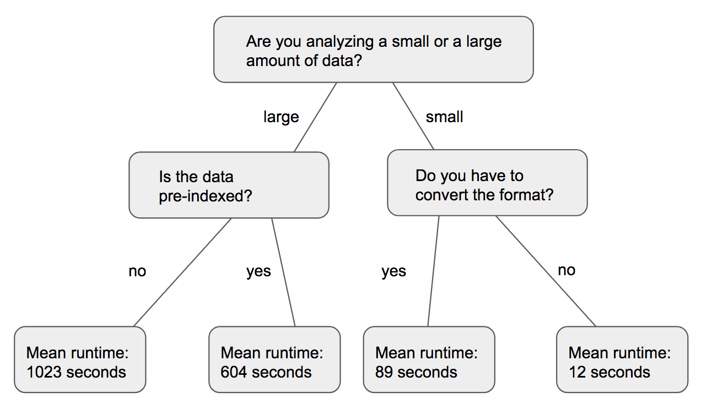
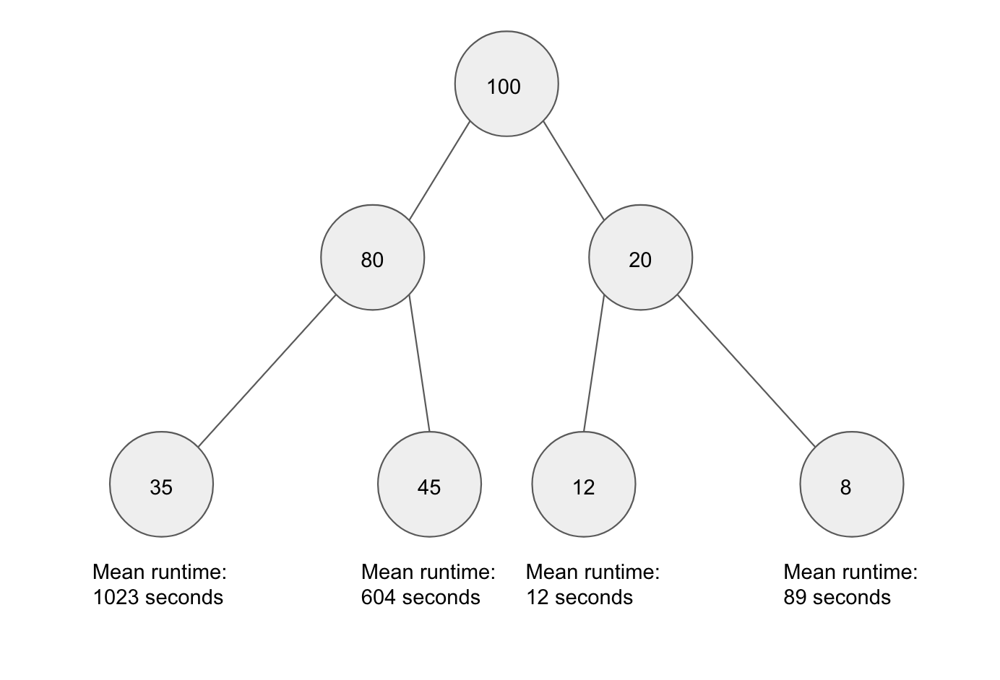
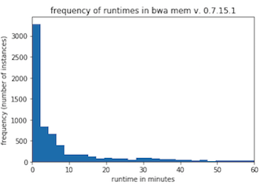
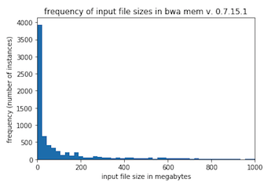
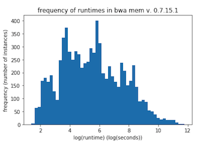
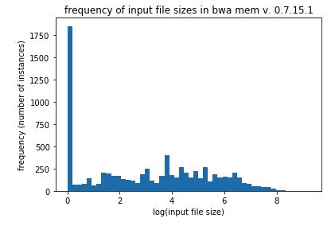
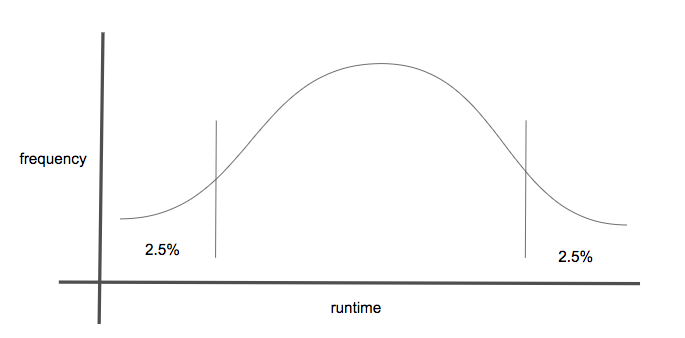
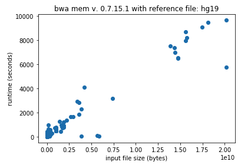
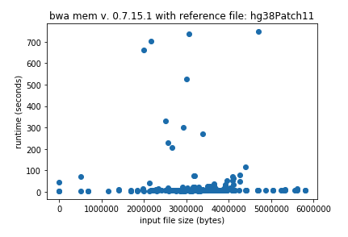

# The Analysis of Data Collected by the Galaxy Project

## Abstract
The public server of the Galaxy Project ( http://usegalaxy.org ) has been collecting extensive job run data on all analyses since 2013. This large collection of jobs run instances (with their corresponding attributes) can be leveraged to determine more efficient ways for allocation of Galaxy server resources. In addition, these data represent the largest, most comprehensive dataset available to date on the runtime dynamics for some of the most popular biological data analysis software. In this work we were aiming at creating a model for runtime prediction of complex algorithms trained on real data. In this paper we will:

1. Present statistical summaries of the dataset, describe its structure, identify the presence of
undetected errors, and discuss any other insights into the Galaxy server that we believe will be
useful to the community.
2. Confirm that the random forest regressor gives the best performance for predicting the runtime
of complex algorithms as was seen by Hutter et al.
3. Discuss the benefits and drawbacks of using a quantile random forest for creating runtime
prediction confidence intervals.
4. Present an alternative approach for choosing a walltime for complex algorithms with the use of
a random forest classifier.

Studying the Galaxy Project dataset reveals that there may be room to fine tune the resource allocation.
The ability to determine appropriate walltimes will save server resources from jobs that result in errors
undetected by the server — such as jobs that fall into infinite loops. Once freed, these resources can then be used to run jobs in the queue without the need to allocate additional hardware.

## Table of Contents

- [Background](#what-is-the-galaxy-project)
  + [What is the Galaxy Project](#what-is-the-galaxy-project)
  + [scikit-learn and machine learning](#scikit-learn-and-machine-learning)
  + [Previous work on runtime prediction of programs](#previous-work-on-runtime-prediction-of-programs)
- [Overview of Data](#overview-of-data)
  + [Distribution of the Data](#distribution-of-the-data)
  + [Undetected Errors](#undetected-errors)
  + [user selected parameters](#user-selected-parameters)
  + [attribute preprocessing](#attribute-preprocessing)
- [Model Comparison](#model-comparison)
- [Estimating a Range of Runtimes](#estimating-a-range-of-runtimes)
- [Using a random forest classifier](#using-a-random-forest-classifier)
- [Future Work](#future-work)
- [References](#references)

### What is the Galaxy Project

The Galaxy Project is a platform that allows researchers to run popular bioinformatics analyses quickly and easily. In the past, trying to run a popular analysis would require downloading, configuring, and troubleshooting the analysys software on one's own machines. This can be a difficult and time consuming task.

With the Galaxy Project, researchers run analyses on the public Galaxy server. To do so, the user needs only to connect to www.usegalaxy.org, upload their data, choose the analysis and the analysis parameters (if any), and hit run. The output can be viewed once it is finished.

For more information visit www.galaxyproject.org.

### scikit-learn and machine learning

scikit-learn is a library of machine learning tools for Python. It has classes for anything machine learning related - from data prepocessing to regression and classification to model evaluation. The sci-kit learn library is the main library we used in our tests, specifically the regression and classification classes.

In this paper our main tool for regression and classification was the random forest, so we will briefly go over random forests now.

A random forest is a collection of decision trees, and a desion tree is a series of questions asked about an object. At the end of the questions, a previously unkown attribute of the object is guessed. An example of a decision tree is shown below. In this case, the decision tree tries predict how long a job is going to take.

The decision tree learns what questions to ask by training on a training set of previous jobs. At each node, it looks at a subset of attributes and chooses to split the data in the way that most minimizes variability in the subsequent two nodes. In this way, it sorts objects by similarity of the dependent and independent variables. In the figure below, a decision tree is training on a set of 100 jobs. All 100 jobs start at the root node, and they are split up as they travel down the tree. Once the tree is trained, it can then be used to predict the runtime of previously unseen jobs.

A random forest is a collection of decision trees, each of which are trained with a unique random seed. The random seed determines which sub-sample of the data each decision tree is trained and which sub-sample of attributes each tree uses and which splits each tree attempts. By implementing these constraints, the random forest protects itself from overfitting - a problem to which decision trees are susceptible.

Incidently, the decision tree also offers a way to see which independent attributes have the greatest effect on the dependent attribute. The more often a decision tree uses an attibute to split a node, the larger it's implied effect on the dependent attribute. The scikit-learn Random Forest classes have an easy way of getting this information with the feature_importances_ class attribute.

### Previous work on runtime prediction of programs

The prediction of runtimes of complex algorithms using machine learning approaches has been done before. [[1]](https://doi.org/10.1007/11508380_24)[[2]](https://doi.org/10.1109/CCGRID.2009.58)[[3]](https://doi.org/10.1145/1551609.1551632)[[4]](https://doi.org/10.1109/CCGRID.2009.77)[[5]](https://doi.org/10.1007/11889205_17)

In a few works, new machine learning methods are designed specifically for the problem. In 2008, [Gupta et al.](http://doi.org/10.1109/ICAC.2008.12) proposed a tool called a PQR (Predicting Query Runtime) Tree to classify the runtime of queries that users place on a server. The PQR tree dynamically choose runtime bins during training that would be appropriate for a set of historical query runtimes. The paper notes that the PQR Tree outperforms the decision tree.

Most previous works tweak and tailor old machine learning methods to the problem. For instance, in 2010, [Matsunaga](http://doi.org/10.1109/CCGRID.2010.98) enhances on the PQR Tree by adding linear regressors at its leaves, naming it PQR2. They test their model against two bioinformatic analyses tools: BLAST (a local alignment algorithm) and RAxML (a phylogenetic tree constructer). The downside of PQR2 is that there are not readily available libraries of the model in popular programming languages like Python or R.

The most comprehensive survey of runtime prediction models was done by [Hutter et al.](https://doi.org/10.1016/j.artint.2013.10.003) In 2014. In the paper, they compared 11 regressors including ridge regression, neural networks, Gaussian process regression, and random forests although they did not include PQR tree in their evaluations. They found that the random forest outperforms the other regressors in nearly all assessments and is able to handle high dimensional data without the need of feature selection.

In our paper, we verify that random forests are the best model for the regression, discuss the merits of quantile regression forests, and present a practical approach for determining an appropriate walltime with the use of a classifier.

## Overview of Data

All of the tools found on usegalaxy.org are tracked. The data is collected using the Galactic Radio Telescope (GRT), which records a comprehensive set of job run attributes.

This includes:

* create time
* runtime
* user selected parameters (tool specific)
* state ("ok", "error", or other)
* input data
  - size of input data
  - filetype of input data (.fastq, .fastq.gz, ...)
* hardware info
  - memory allocated
  - swap memory allocated
  - number of processors allotted
  - destination id (which node the job was run on)
* user info
    - user id
    - session id
    - history id

The Galaxy dataset contains runtime data for 1372 different tools that were run on the Galaxy Servers over the past five years. A statistcal summary of those tools, ordered by most popular, can be found [here](summary_of_tools.csv).

The Galaxy server has three different clusters with different hardware specifications. The hardware on which a job was run is recorded in the dataset. [I need to put hardware specs here. or a link to them]

The CPUs are shared with other jobs running on the node, so the perfomance of jobs is effected by the server load at the time of execution. This attribute is not in the published dataset, but we began tracking it not long before writing this, and will publish those datasets when available.

#### Distribution of the Data

Typically, machine learning algorithms, such as, random forests and neural networks prefer to use data with a normal distribution. The distribution of runtimes and filesizes in the Galaxy dataset are highly skewed. The distribution for a tool called BWA (version 0.7.15.1) can be seen below.

In this project, we address this skewness by doing a log transform on the data.
We use numpy's log transformer numpy.log1p which transforms the data by log(1+x)

This transformation works for most of the runtime and intput file size attributes to give a more balanced distribution.

#### Undetected Errors

One hurdle the dataset presents is that it contains undedected errors - errors that occured but were not recorded.

For example, some tools require that an input file be provided. Bwa mem is one such tool. If an input file is not provided, bwa mem should not run at all or else the run should result in an error. In spite of this, the number of bwa mem v. 0.7.15.1 jobs in the dataset that ran succesfuly and without an input file is 49 or 0.25% of "successful" jobs. These jobs should not have run at all, and yet they are present in the dataset and marked as succesfuly completed.

Whether the errors were be caused by bugs in the tool code, malfunctions in the server, mistakes in record keeping, or a combination of these, the presence of these of errors is troubling. With undetected input file errors, it is trivial to identify and remove the culprits from the dataset. However, these errors call into question the validity of the rest of the data. If there are many other jobs similarly mislabelled as "sucessfully completed" that are not as easily identified as input file errors, and these mislabelled jobs are used to train a machine learning model, they could skew the predictions.

Another method of screening the dataset for undetected errors is by looking for jobs that ran faster than possible and jobs that ran slower than probable. A job that finishes in an unreasonably short time (such an human genome alignment job that finishes in 6 seconds), or a job that finishes in an unreasonably long time (such as a ??). However, indentifying these errors requires the trained eye of someone who is both familiar with the tools and has ample time to look through the dataset.

Using this hueristic, we can account for undetected errors by getting rid of the jobs that took the longest and the shortest amount of time to complete.

This requires choosing quantiles of contamination for each tool. In the figure above the quantiles used are 2.5%. For bwa mem (v. 0.7.15.1) - an alignment algorithm - 2.5% of jobs in the collected data took 4 seconds or less to finish. Are all of these jobs undedected errors? If we increase the unreasonable runtime threshhold, we see that 5% of jobs took 5 seconds or less to finish. It is difficult, even for a human, to decide if these recordings are reasonable job runtimes.

Since we know that the two variables that have the greatest affect on the runtime of bwa mem are input file size and reference file size. The larger the file sizes, the longer it would take for the job to run. We should be considering these variables when looking for undetected errors. One method of doing this is by freezing all of the other variables and only looking at the relationship between these input file sizes and runtime.

In the following figures all of the user selected parameters are frozen except for input file size. We were able to freeze the reference file size because many reference genomes, such as the human genome, are popular and commonly used.

The refernece file, hg19 is the human genome

The reference file, hg38 is another version of the human genome.

The first graph shows a strong correlation between input file and runtime. This is the correlation we expect. The outliers that we remove are the datapoints in the bottom right corner. We can do this safely because, while it is possible for a job to run longer than the correlation displayed on the graph, it is impossible for jobs to run faster.

The second graph, displays complete uncorrelation between runtime and input file size. In this case, we would throw all of the datapoints away.

Using this method to prune out bad jobs requires examining each tool individually or, at the least, it requires writing instructions for each tool individually - instructions that the computer can follow to do the pruning. This type of analysis would lead to the best results, but at the time of this writing, it has not been completed for the Galaxy dataset.

A final method of undetected error detection that we will discuss is with the use of an isolation forest. In a regular random forest, a node in a decision tree chooses to divide data based on the attribute and split that most greatly decreases that variability of the following to datasets. In an isolation forest, the data is split based on a random selection of an attribute and split. The longer it takes to isolate a datapoint, the less likely it is an outlier. As with removing the tails of the runtime distribution, we need to choose the percentage of jobs that are bad before hand.

To remove bad jobs, we used the isolation forest with contamination=0.05. We also removed any obvious undetected errors, such as no-input-file errors, wherever we could.

#### User Selected Parameters

Before we move on to the machine learning models, we also should discuss which variables we used to train the prediction models. The GRT records all parameters passed through the command line. This presents in the dataset as a mixed bag of useful and useless attributes. Useless attributes include:

* labels (such as plot axes names)
* redundent parameters (two attributes that represent the same information)
* identification numbers (such as file ids)

Useful atttributes include:

* file sizes
* file types (compressed or uncompressed)
* whether the data was pre-indexed
* analysis type selection
* other analysis parameters

Instead of hand selecting parameters for each tool, we made a filter for the computer to do the pruning. It is a simple filter that attempts to remove any labels or identification numbers that are present.

The parameters are screened in the following way:

1. Remove universally unuseful parameters such as:
  + \__workflow_invocation_uuid__
  - chromInfo
  - parameters whose names end with "|\__identifier__"
2. Remove any categorical parameters whose number of unique categories exceed a threshhold

With these filters, we are able to remove most of the parameters that are either identifiers or labels. Since identifiers and labels are more likely to negatively affect and add noise to the results of a machine learning model we are more concerned with removing these than removing reduntant parameters. In this paper, we used a unique category threshhold of 10.

There are also some important attributes, that are not immediately available in the dataset. For instance, the complexity of bwa mem is O(reference size \* input file size), which is linearly correlated with runtime. However, this product is not a variable of the bwa mem dataset, but can be calculated and added. Just to note, in the Galaxy dataset, if the reference genome *name* is provided then the reference genome *size* is not provided. This is because of the method in which the attributes were tracked.

Because the random forest is able to find non-linear relationships, we did not combine attributes in the preprocessing step. Combining attributes in preprocessing may make it easier for the random forest to find relationships, which would improve results. However, combining relavent parameters for each tool would require close monitoring and attention, and this is out of the scope of the project.

#### Attribute Preprocessing

There are cetain types of data that machine learning models prefer. For the sci-kit learn models, it is advised that the continuous variables be normally distributed and centered about zero, and that the categorical variables be binarized.

For the continuous variables, as previously noted, we log transform with numpy.log1p if the variable is highly skewed. Then, we scale the continuous variable to the range [0,1] with sklearn.preprocessing.MinMaxScaler.

For categorical variables, we binarize them using sklearn.preprocessing.LabelBinarizer. An example of label binarization is shown below. The categorical variable "analysis_type" is expanded into four discrete variables that can take the values 0 or 1.

||x1|x2|x3|x4|
|---|---|---|---|---|
| illumina  | 1  | 0  | 0  |0|
|full   |0   | 1  | 0  |0|
|pacbio   |0   | 0  | 1  |0|
|ont2d   |0   | 0  | 0  |1|

We typically have two or three continuous variables for each tool, and about one hundred expanded categorical variables. Some tools, that accept multiple input files, such as cuffnorm, can have hundreds of continuous variables. Other tools, that do not have many options,  such as fastq groomer, may have only a handful of expanded categorical variables.

## Model Comparison

In this work, we trained popular regression models available on scikit-learn and compared their performance. We used a cross validation of three and tested the models on the dataset of each tool without removing any undedected errors and with removing undetected errors via the isolation forest with contamination=5%. Pruning the datasets with the isolation forest only affects the performance of the models slightly.

We used the Default Settings for the sklearn Linear Regressor, LASSO, Ridge Regressor, SVR Regressor, and SGD Regressor. The neural network (sklearn.neural_network.MLPRegressor) had two hidden layers of sizes [100,10] with the rest of the attributes set to default, and the random forest had 100 trees and a max_depth of 12.

The table below shows the r-squared score for a select number of tools, and the total mean and median taken from the performance over each tool with more than 100 recorded runs.

|                    | Random Forest | Lasso | MLPRegressor | Ridge | SGDRegressor | SVR |LinearRegression|
|--------------------|---------------|------------------|-------|--------------|-------|--------------|-----|
| bwa v 0.7.15.1     | 0.907309 | -0.000351 | 0.639557 | 0.552426 | 0.245956 | 0.259903 | NaN |
| bwa mem v 0.7.15.1 |  0.823522 | -0.000149 | 0.714105 | 0.396975 | 0.169044 | NaN | NaN |
| fastq groomer v 1.1.1 | 0.994533 | -9.9e-05 | 0.968487 | 0.512761 | 0.280944 | 0.452238 | NaN |
| megablast v 1.2.0  | 0.77818 | -0.000959 | 0.30325 | 0.293292 | 0.195893 | 0.221871 | NaN|
| total mean         | 0.59 | -0.01 | 0.26 | 0.32 | 0.09 | 0.14 | -0.25 |
| total median   |0.70 | -0.008 | 0.26 | 0.33 | 0.06 | 0.10 | 0.18 |

The performance is marked as NaN if it's r-squared scores was below -10.0, as was often the case with the linear regressor. We also marked a score as NaN if a model took more than 5 minutes to train, as was sometimes the case with the SVR Regressor, whose complexity scales quickly with the number of datapoints in the set. The total mean and the total median were taken from the performance of each model over all of the tools with more than 100 recorded runs.

Pruning out outliers with contamination=0.05 affected the predictions as follows.

|                    | Random Forest | Lasso | MLPRegressor | Ridge | SGDRegressor | SVR |LinearRegression|
|--------------------|---------------|------------------|-------|--------------|-------|--------------|-----|
| bwa v 0.7.15.1     | 0.906882 | -0.000447 | 0.777334 | 0.556928 | 0.244509 | NaN | NaN |
| bwa mem v 0.7.15.1 |  0.821532 | -0.000136 | 0.717181 | 0.388933 | 0.168009 | NaN | NaN |
| fastq groomer v 1.1.1 | 0.994565 | -6.4e-05 | 0.966611 | 0.513012 | 0.281224 | NaN | NaN|
| megablast v 1.2.0  | 0.779925 | -0.000227 | 0.303499 | 0.298224 | 0.195356 | NaN | NaN|
| total mean         | 0.60 | -0.01 | 0.26 | 0.32 | 0.09 | NaN | -0.13 |
| total median   |0.71 | -0.0004 | 0.25 | 0.33| 0.06 | NaN | 0.21 |

The linear regressor was not able to handle the high-dimensional and categorical data. Total number of egregious error - those with r-squared score less than -10.0 is shown below.

|                    | Random Forest | Lasso | MLPRegressor | Ridge | SGDRegressor | SVR |LinearRegression|
|--------------------|---------------|------------------|-------|--------------|-------|--------------|-----|
| number of r-squared less than -10.0     | 0 | 0 | 0 | 0 | 14 | 0 | 596 |

The full results can be viewed [here](comparison_benchmarks.csv). It includes the time (in seconds) to train the model. And the results for the dataset pruned with the isolation forest can be found [here](comparison_benchmarks_minus_outliers.csv)

## Estimating a Range of Runtimes

The random forest gave us the best results for estimating the runtime of a job. It would be more useful, though, to estimate a range of runtimes that the job would take to complete. This way, when using the model for choosing walltimes, we lower the risk of ending jobs prematurely.

A [quantile regression forest](https://doi.org/10.1.1.170.5707) can be used for such a purpose. A quantile forest works similarly to a normal random forest, except that at the leaves of its trees, the quantile random forest not only stores the means of the variable to predict, but all of the values found in the training set. By doing this, it allows us to determine a confidence interval for the runtime of a job based on similar jobs that have been run in the past.

Storing the entire dataset in the leaves of every tree is computationally costly. An alternative method is to store the means and the standard deviations. Doing so reduces the accuracy of the time ranges, but saves a lot of space.

We used the modified version of the quantile regression forest that is described in [Hutter et al.](https://doi.org/10.1016/j.artint.2013.10.003) that uses standard deviation instead of quantiles. A prediction that is within one standard deviation of one of the actual value was counted as an accurate prediction.

We tested the quantile regression forest against the historical data with three fold validation. We tested it on the data with undetected errors unpruned and on the data with 5% of the jobs pruned by an isolation forest.

The results can be viewed [here](). A summary is also shown below.

##### Mean accuracy of 3-fold cross-validated tests

||unpruned|pruned|
|---|---|---|
|all tools|0.59|0.69|

The largest drawback of the quantile regression forest is that the time ranges that it guesses are very large. These large time ranges are not useful for runtime estimates for users, but they may be useful for creating walltimes. Because of the skewed nature of the runtime distribution, the quantile random forest tends to underestimate rather than overestimate, which is problematic. In addition, if there are bad jobs present in the training dataset, it would make the confidence intervals larger than they should be.

<!--  -->

## Using a random forest classifier

The main avantage of a random forest classifier over a quantile regression forest, is that you can select the size of the runtime bins. Where in the quantile regression forest, you are at the mercy of the bins dynamically selected by the model.

In our tests, we chose buckets in the following fashion.
1. We ordered the jobs by length of runtime.
2. Then, we made (0, median] our first bucket.
3. We recursively took the median of the remaining runtimes until the number of remaining runtimes was less than 100.

|------------50%-----------|-----25%-----|--12.5%--|--12.5%--|      < ---- division of jobs

0-------------------------50s----------612s------4002s-----10530s   < ---- buckets

For example, for bwa mem the buckets we found (in seconds) were

[0, 155.0, 592.5, 1616.0, 3975.0, 7024.5, 10523.0, 60409.0]

As the buckets become larger. the number of jobs in the bucket decrease by 1/2^i where i is the bucket. For bwa mem, the last bucket, where i=7, holds only 0.78% of the jobs. Dividing it further would make it so the next bucket created has less than 100 jobs, which we chose as the threshold.

This method of creating buckets puts an arbitrary limit on the longest amount of time that a tool is allowed to run based on the longest a job has been observed to run. It is also susceptible to false positives at the longer runtime buckets if trained by a contaminated dataset.

The results of the classifier can be found [here](clf_pred_metrics.csv).

## Future Work

Recently, we have set up the GRT to track additional job attributes: amount of memory used (rather than just memory allocated, which is currently tracked), server load at create time, and CPU time. Once enough data is collected, we want to create models to predict memory usage and CPU time and evaluate their performance.

We also want to find the effect of processor count on runtime. Currently, every job is allotted 32 processor cores, so we do not have the data to investigate the relationship between number of processors and runtime. In the future, we plan to add random variability to the number of processor cores allotted, so that we can see how great of an effect parallelability has on these bioinformatic algorithms.

## References

Scikit-learn: Machine Learning in Python, Pedregosa et al., JMLR 12, pp. 2825-2830, 2011.
